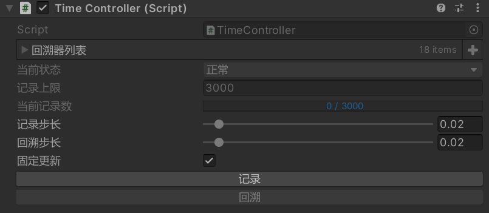
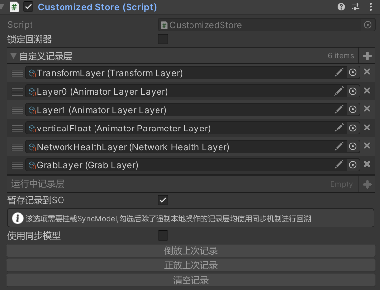
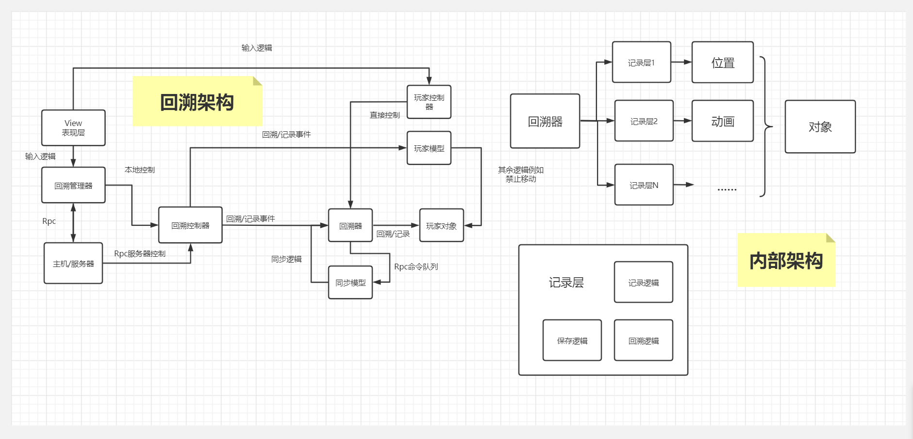

# 时间回溯 TimeControl 简介 Intro


[爱姬kurisu](https://space.bilibili.com/20472331)设计的一个时间回溯系统，包含基础的Transform回溯器，基于Animator录制的动画回溯器,基于记录层结构的自定义回溯器。支持游戏中记录、回溯和重播。你也可以自定义记录数据、记录层和回溯器，拓展记录方法和回溯方法，从而快速实现一些非线性时空的游戏玩法！(不包含Netcode部分代码)

## 安装

* 直接复制到自己项目中，使用时using相应命名空间
* 如出现报错说明没有Odin插件，可将代码中标红Attribute去除，不影响使用

## 使用
1. 在场景内创建空物体添加TimeController和TimeManager脚本
2. 在希望回溯的物体上添加基础回溯器TimeStore
3. 设置TimeManager的触发按键，游戏中按下进行记录和回溯

4. 尝试其他类型的回溯器例如RecordStore
5. 尝试自定义的回溯器如CustomizedStore
6. 自定义回溯器需要设置自定义记录层，你可以右键Create/TimeControl找到可以设置的记录层。例如AnimatorLayerLayer可以记录动画状态机中一个层级的数据，你需要为layerIndex赋值来设置记录的层级。记录层设置完后将作为一个模板，你可以给不同回溯器上添加相同的记录层，在游戏运行时回溯器会根据模板复制出新的实例。

## 拓展

* 自定义回溯器=>继承CustomizedStore(如对回溯的方式有需求则可以自定义回溯器,如只是想拓展记录和回溯的对象则只需自定义记录层并添加到CustomizedStore的列表中)
* 自定义记录层=>继承GenericLayer
```c#
    [System.Serializable]
public struct TransformStep:ITimeStep
{
    public Vector3 position;
    public Quaternion rotation;
}
[CreateAssetMenu(fileName = "TransformLayer", menuName = "TimeControl/TransformLayer")]
public class TransformLayer : GenericLayer<TransformStep>
{
    private Transform transform;
    public override void Record()
    {
        TransformStep newStep=new TransformStep();
        newStep.position=transform.position;
        newStep.rotation=transform.rotation; 
        steps.Push(newStep);
    }
    protected override void Execute(TransformStep result,bool playBack)
    {
        //playBack为倒播,回溯时默认为true
        transform.position=result.position;
        transform.rotation=result.rotation;
    }
    public override void Init(int Capacity,CustomizedStore store)
    {
        base.Init(Capacity,store);
        //对GameObject的引用可以从CustomizedStore身上获取
        transform=store.transform;
    }
    
}
```
* 自定义同步=>继承ITimeSync接口

## 联网拓展
* 可以使用Netcode结合同步接口实现主机端和客户端的回溯同步
## 架构

## 样例

* [Unity第一届GameJam特别奖作品《逆时空》](https://www.bilibili.com/video/BV1XR4y1D7t8/)

